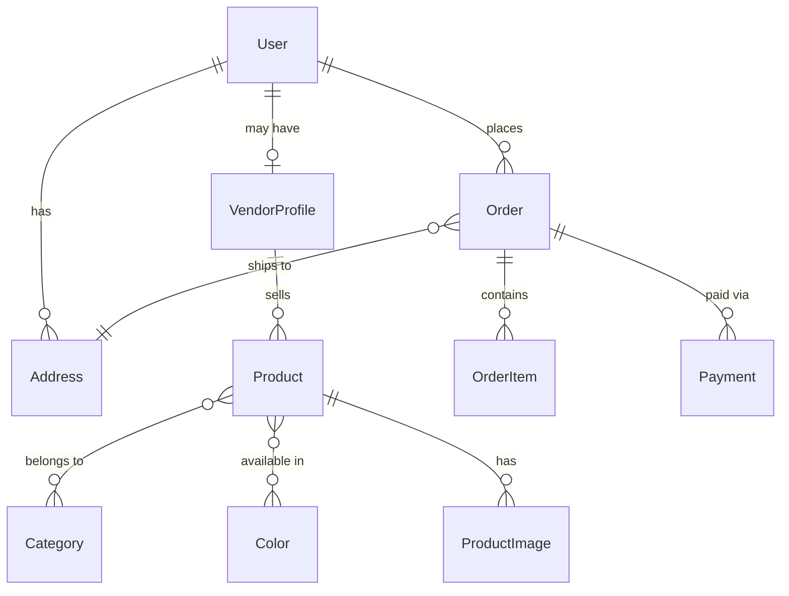

# AGENT.md - AI Agent Development Guide

## Project Overview

**Krafted Furniture** is a luxury furniture e-commerce platform with multi-vendor marketplace support, built with Next.js 15, TypeScript, Prisma, and PostgreSQL.

### Core Features
- Multi-vendor marketplace
- Email verification & Google OAuth
- Delivery address management
- Mobile-first luxury UI/UX
- Optimized Next.js rendering (SSG/SSR/ISR)
- Payment integration (Razorpay & Stripe)
- Real-time inventory management

### Tech Stack
- **Framework**: Next.js 15 (App Router)
- **Language**: TypeScript (strict mode)
- **Database**: PostgreSQL (Neon serverless)
- **ORM**: Prisma
- **Auth**: NextAuth v4
- **Media**: Cloudinary
- **Animations**: Framer Motion
- **Styling**: Tailwind CSS
- **Payments**: Razorpay, Stripe

## Architecture

### Directory Structure

```
d:\Krafted_Furniture/
├── app/
│   ├── admin/                 # [NEW] Admin Dashboard & Management
│   │   ├── products/          # Product CRUD
│   │   ├── categories/        # Category List
│   │   └── layout.tsx         # Admin Sidebar & RBAC
│   ├── checkout/              # [NEW] Checkout Flow
│   │   └── address/           # Address Management
│   ├── wishlist/              # [NEW] Wishlist Page
│   ├── api/                    # API routes
│   │   ├── auth/              # NextAuth endpoints
│   │   ├── products/          # Product CRUD
│   │   ├── categories/        # Category management
│   │   ├── vendors/           # Vendor management
│   │   ├── orders/            # Order processing
│   │   ├── payments/          # Payment handling
│   │   ├── cart/              # Shopping cart
│   │   ├── wishlist/          # [NEW] Wishlist
│   │   └── users/             # User management
│   ├── (pages)/               # Page routes
│   ├── layout.tsx             # Root layout
│   └── page.tsx               # Homepage
├── components/
│   ├── home/                  # Homepage components
│   ├── product/               # Product components
│   ├── shop/                  # Shop page components
│   ├── cart/                  # Cart components
│   │   └── CartClient.tsx     # [NEW] Client-side Cart Wrapper
│   ├── layout/                # Layout components
│   ├── ui/                    # Reusable UI components
│   └── providers/             # Context providers
├── lib/
│   ├── prisma.ts              # Prisma client singleton
│   ├── auth.ts                # NextAuth configuration
│   ├── cart/                  # [NEW] Cart Service
│   │   └── service.ts         # Server-side Cart Fetching
│   ├── cloudinary.ts          # Cloudinary integration
│   └── utils.ts               # Utility functions
├── prisma/
│   ├── schema.prisma          # Database schema
│   ├── seed.ts                # Database seeding
│   └── migrations/            # Migration history
├── types/                     # TypeScript definitions
└── config/                    # App configuration
```

### Database Schema

#### Core Models

**User** - Authentication and profile
- Roles: USER, VENDOR, ADMIN
- Email verification support
- Password reset tokens
- Relations: addresses, vendorProfile, carts, orders

**VendorProfile** - Vendor business information
- Business details (name, email, phone)
- Verification status
- Commission rate
- Relations: user, products

**Address** - Delivery addresses
- Full address fields
- Geolocation (lat/long)
- Default address marking
- Relations: user, orders

**Product** - Product catalog
- Basic info (name, description, price)
- Material and dimensions
- Relations: vendor, categories, colors, images, inventory

**Category** - Hierarchical categories
- Types: PRODUCT_TYPE, ROOM, STYLE, CAMPAIGN
- Self-referencing for subcategories
- Many-to-many with products

**Order** - Order processing
- Status tracking
- Payment status
- Shipping address
- Relations: user, items, payments, address

**Payment** - Payment tracking
- Multiple providers (Razorpay, Stripe)
- Transaction history
- Raw response storage

#### Key Relationships



## Authentication System

### NextAuth Configuration

**Location**: `lib/auth.ts`

**Providers**:
1. **Google OAuth** - Social login
2. **Credentials** - Email/password

**Session Strategy**: JWT

**Key Features**:
- Role-based access (USER, VENDOR, ADMIN)
- Email verification flow
- Password reset functionality
- Auto-create user on Google sign-in

### Protected Routes

**Middleware**: `middleware.ts`

```typescript
// Protected route patterns
/admin/*        -> ADMIN role required
/vendor/*       -> VENDOR role required
/user/dashboard -> Authenticated user required
```

### Email Verification Flow

1. User registers with email/password
2. `emailVerifyToken` generated and stored
3. Verification email sent
4. User clicks link → token validated
5. `emailVerified` timestamp set
6. User can now log in

### Password Reset Flow

1. User requests password reset
2. `resetToken` and `resetTokenExpiry` generated
3. Reset email sent
4. User clicks link → token validated (check expiry)
5. User sets new password
6. Tokens cleared

## API Route Patterns

### Standard Response Format

```typescript
// Success
{
  success: true,
  data: { ... }
}

// Error
{
  success: false,
  error: "Error message"
}
```

### Authentication Check

```typescript
import { getServerSession } from "next-auth";
import { authOptions } from "@/lib/auth";

export async function GET(req: Request) {
  const session = await getServerSession(authOptions);
  
  if (!session) {
    return Response.json(
      { success: false, error: "Unauthorized" },
      { status: 401 }
    );
  }
  
  // Your logic here
}
```

### Role-Based Access

```typescript
// Admin only
if (session.user.role !== "ADMIN") {
  return Response.json(
    { success: false, error: "Forbidden" },
    { status: 403 }
  );
}

// Vendor or Admin
if (!["VENDOR", "ADMIN"].includes(session.user.role)) {
  return Response.json(
    { success: false, error: "Forbidden" },
    { status: 403 }
  );
}
```

### Prisma Query Pattern

```typescript
import { prisma } from "@/lib/prisma";

try {
  const products = await prisma.product.findMany({
    where: { isActive: true },
    include: {
      images: {
        orderBy: { priority: 'asc' }
      },
      colors: {
        include: { color: true }
      },
      vendor: {
        include: { user: true }
      }
    },
    take: 20,
    skip: 0
  });
  
  return Response.json({ success: true, data: products });
} catch (error) {
  console.error("Database error:", error);
  return Response.json(
    { success: false, error: "Internal server error" },
    { status: 500 }
  );
}
```

## Vendor System

### Vendor Registration Flow

1. User registers as normal user
2. User applies to become vendor (creates VendorProfile)
3. Admin reviews and verifies vendor
4. Vendor can now add products

### Vendor Product Management

**Permissions**:
- Vendors can only edit their own products
- Admins can edit all products

**Validation**:
```typescript
// Check product ownership
const product = await prisma.product.findUnique({
  where: { id: productId },
  include: { vendor: true }
});

if (product.vendor.userId !== session.user.id && session.user.role !== "ADMIN") {
  return Response.json(
    { success: false, error: "Forbidden" },
    { status: 403 }
  );
}
```

## Next.js Rendering Strategy

### Page Types & Strategies

| Page | Strategy | Revalidate | Metadata |
|------|----------|------------|----------|
| Homepage | ISR | 60s | Static |
| Product Detail | SSR | - | Dynamic |
| Category | ISR | 300s | Dynamic |
| Search | SSR | - | Dynamic |
| User Dashboard | SSR | - | Dynamic |
| Vendor Dashboard | SSR | - | Dynamic |
| About/FAQ | SSG | - | Static |

### SSG Example (Static Pages)

```typescript
// app/about/page.tsx
export const metadata = {
  title: "About Us - Krafted Furniture",
  description: "Learn about our luxury furniture craftsmanship"
};

export default function AboutPage() {
  return <div>About content</div>;
}
```

### ISR Example (Homepage)

```typescript
// app/page.tsx
export const revalidate = 60; // Revalidate every 60 seconds

export default async function HomePage() {
  const products = await prisma.product.findMany({
    where: { isActive: true },
    take: 10
  });
  
  return <div>{/* Render products */}</div>;
}
```

### SSR Example (Product Detail)

```typescript
// app/product/[slug]/page.tsx
export async function generateMetadata({ params }) {
  const product = await prisma.product.findUnique({
    where: { slug: params.slug }
  });
  
  return {
    title: `${product.name} - Krafted Furniture`,
    description: product.description
  };
}

export default async function ProductPage({ params }) {
  const product = await prisma.product.findUnique({
    where: { slug: params.slug },
    include: { images: true, colors: true, vendor: true }
  });
  
  return <div>{/* Render product */}</div>;
}
```

## Mobile-First Design

### Breakpoints

```css
/* Tailwind config */
sm: 640px   // Small tablets
md: 768px   // Tablets
lg: 1024px  // Laptops
xl: 1280px  // Desktops
2xl: 1536px // Large desktops
```

### Design Principles

1. **Mobile-first**: Design for 320px-640px first
2. **Touch targets**: Minimum 44px × 44px
3. **Single product view**: One product per viewport on mobile
4. **Scroll animations**: Vertical scroll-based reveals
5. **White theme**: Clean, trustworthy aesthetic
6. **Gold accents**: Luxury feel

### Responsive Component Pattern

```typescript
export default function ProductCard() {
  return (
    <div className="
      w-full h-screen           // Mobile: full viewport
      md:w-1/2 md:h-auto        // Tablet: half width
      lg:w-1/3                  // Desktop: third width
      p-4 md:p-6 lg:p-8         // Responsive padding
    ">
      {/* Content */}
    </div>
  );
}
```

## Common Tasks

### Adding a New API Route

1. Create file: `app/api/[resource]/route.ts`
2. Implement HTTP methods (GET, POST, PUT, DELETE)
3. Add authentication check
4. Add validation (Zod recommended)
5. Use Prisma for database operations
6. Return standard response format
7. Add error handling

### Adding a New Page

1. Create file: `app/[route]/page.tsx`
2. Choose rendering strategy (SSG/SSR/ISR)
3. Add metadata export
4. Fetch data if needed
5. Create responsive layout
6. Add loading state (`loading.tsx`)
7. Add error boundary (`error.tsx`)

### Adding a New Component

1. Create file: `components/[category]/[ComponentName].tsx`
2. Use TypeScript for props
3. Make it responsive (mobile-first)
4. Add Framer Motion animations if needed
5. Export from index file if applicable

### Running Database Migrations

```bash
# Create migration
npx prisma migrate dev --name migration_name

# Apply migrations (production)
npx prisma migrate deploy

# Reset database (development only)
npx prisma migrate reset

# Generate Prisma client
npx prisma generate
```

### Seeding Database

```bash
# Run seed script
npx prisma db seed

# Seed script location: prisma/seed.ts
```

## Troubleshooting

### Common Issues

**Issue**: Prisma Client not found
```bash
# Solution
npx prisma generate
```

**Issue**: Database connection failed
```bash
# Check .env file
# Verify DATABASE_URL is correct
# Test connection: npx prisma db pull
```

**Issue**: NextAuth session not working
```bash
# Verify NEXTAUTH_SECRET is set
# Check NEXTAUTH_URL matches your domain
# Clear cookies and try again
```

**Issue**: TypeScript errors after schema change
```bash
# Regenerate Prisma client
npx prisma generate

# Restart TypeScript server in VS Code
# Cmd/Ctrl + Shift + P -> "Restart TS Server"
```

**Issue**: Images not loading from Cloudinary
```bash
# Check CLOUDINARY_* env variables
# Verify image URLs are correct
# Check next.config.js image domains
```

### Debugging Tips

1. **Use Prisma Studio**: `npx prisma studio` to inspect database
2. **Check server logs**: Look at terminal running `npm run dev`
3. **Use console.log**: Add logging in API routes
4. **Check Network tab**: Inspect API requests/responses
5. **Verify environment variables**: Use `process.env` logging

## Best Practices

### Database

- Always use transactions for multi-step operations
- Use `select` to limit returned fields
- Add indexes for frequently queried fields
- Use `include` sparingly (performance impact)
- Validate input before database operations

### API Routes

- Always validate input (use Zod)
- Use try-catch for error handling
- Return consistent response format
- Add rate limiting for production
- Log errors for debugging

### Components

- Keep components small and focused
- Use TypeScript for type safety
- Make components responsive
- Add loading and error states
- Use Framer Motion for animations

### Security

- Never expose sensitive data in API responses
- Validate user permissions
- Sanitize user input
- Use HTTPS in production
- Implement CSRF protection
- Rate limit API endpoints

## Environment Variables

```env
# Database
DATABASE_URL="postgresql://..."

# NextAuth
NEXTAUTH_SECRET="..."
NEXTAUTH_URL="http://localhost:3000"

# Google OAuth
GOOGLE_CLIENT_ID="..."
GOOGLE_CLIENT_SECRET="..."

# Cloudinary
CLOUDINARY_CLOUD_NAME="..."
CLOUDINARY_API_KEY="..."
CLOUDINARY_API_SECRET="..."

# Email (optional)
EMAIL_SERVER_HOST="smtp.gmail.com"
EMAIL_SERVER_PORT="587"
EMAIL_SERVER_USER="..."
EMAIL_SERVER_PASSWORD="..."
EMAIL_FROM="noreply@krafted.com"

# App
NEXT_PUBLIC_APP_URL="http://localhost:3000"
```

## Testing Checklist

Before committing changes:

- [ ] TypeScript compiles without errors (`npx tsc --noEmit`)
- [ ] Linter passes (`npm run lint`)
- [ ] Database migrations work (`npx prisma migrate dev`)
- [ ] API routes return correct responses
- [ ] Authentication works (login, logout, session)
- [ ] Responsive design works on mobile
- [ ] Images load correctly
- [ ] No console errors in browser
- [ ] Performance is acceptable (Lighthouse)

## Resources

- [Next.js Documentation](https://nextjs.org/docs)
- [Prisma Documentation](https://www.prisma.io/docs)
- [NextAuth Documentation](https://next-auth.js.org)
- [Tailwind CSS Documentation](https://tailwindcss.com/docs)
- [Framer Motion Documentation](https://www.framer.com/motion)

---

**Last Updated**: 2025-12-28
**Version**: 1.0.0
